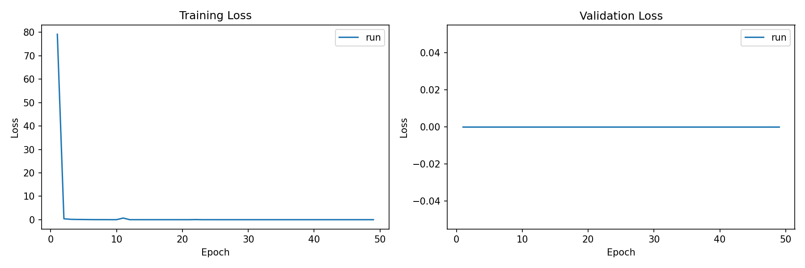
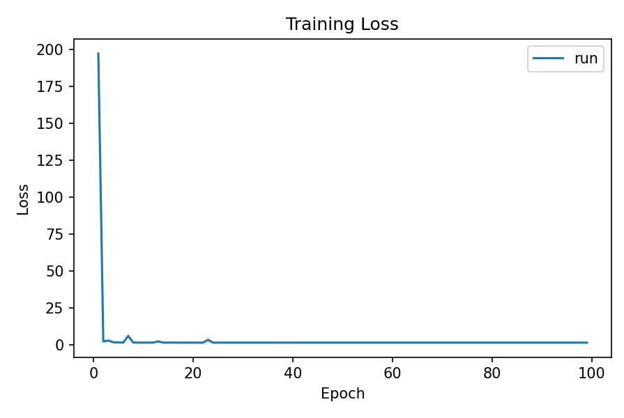

# Attention-based alternative to Cross Modality Framework 

## Description 

This project is based on a proposal for an alternative method to Cross Modality Framework for detection and segmentation, on the DSEC Night dataset. The work is based on the CMDA paper architecture, consisting on an Encoder, a Fusion Module and a Decoder.

The main change with respect to Cross Modality, is the introduction of a **Fusion Module based on Attention between RGB images and events**, thus fusing their features before feeding them into the decoder. 

The reason I chose to use attention in my fusion module was to explore the capacity of this mechanism in the Computer Vision field, as I hypothesized it would make the model gain better context-awareness of pixels in both images and events, leading to a better performance. 

## Files for implementation 

The proposed method is implemented through the following files:

- [Fusion Module](model/my_fusion_module.py) — Cross-attention fusion module
- [Model Architecture](model/model_proposal.py) — Full pipeline wiring
- [Configuration](configs/model_proposal.yaml) — Training and evaluation configuration

## Results 
The main comparison can be seen in the training phase. The attention-based fusion module makes the model converge to a much lower loss, much sooner. Both methods converge rapidly to a low loss and stay around that value for the rest of the epochs, with Cross Modality setting at around 1.38 most of the training, whereas the fusion module goes as low as a .001 order of magnitude within the first 10 epochs, before stabilizing. Although this range might indicate overfitting risk, it's worth mentioning the training process was much faster and the loss was lower. The improved efficiency could be attributed to how the Fusion Module handles both modalities at the same time, instead of separately.

Here we can see the training loss from the Fusion Module
<div style="width: 50%; overflow: hidden;">
  
</div>

Here is the training loss of the Cross Modality model
<div style="width: 50%; overflow: hidden;">
  
</div>

## How to run the attention-based method 

First of all, the environment must be activated and the dependencies installed. We do this through this script:

    ```conda activate CMF
    sh install_req.sh```

Once we've done that, just like with the original Cross Modality framework:

1. Ensure the root directory of each dataset (or a symlink to it) is placed within the `data/` folder.
2. Run the appropriate script to generate the train and validation split files.

    - **For Cityscapes:**
         ```
        python dataset/create_cs_txt.py
        ```

        - **For DSEC-Night:**
            ```bash
            python dataset/create_dataset_txt.py
            ```
    - After having both the dataset and environment ready, we can train the model through this command:
      ```bash
      python train_from_config.py configs/model_proposal.yaml
      ```
    - Then, to evaluate:
      ```shell
      python detect_from_config.py --config config/model_proposal.yaml --checkpoint path/to/your/checkpoint.pth --input_image path_to_image
      ```